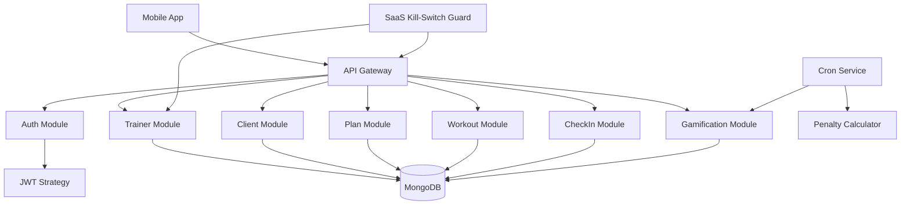
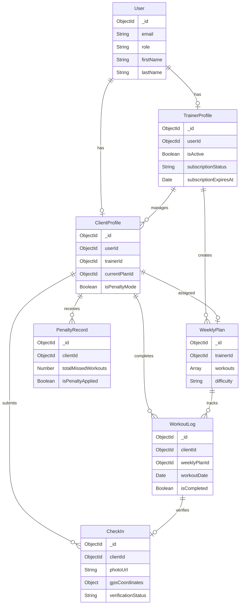

# KINETIX Backend Masterplan
## High-Performance Gym SaaS Platform

**Version:** 1.0  
**Framework:** NestJS (Modular Architecture)  
**Database:** MongoDB with Mongoose ODM  
**Auth Strategy:** JWT with Role-Based Access Control (RBAC)

---

## Table of Contents
1. [System Architecture Overview](#system-architecture-overview)
2. [Folder Structure](#folder-structure)
3. [Database Schema Definitions](#database-schema-definitions)
4. [Core Business Logic Implementation](#core-business-logic-implementation)
5. [API Endpoint Strategy](#api-endpoint-strategy)
6. [Authentication & Authorization](#authentication--authorization)
7. [Middleware & Guards](#middleware--guards)
8. [Background Jobs & Cron Tasks](#background-jobs--cron-tasks)
9. [AI Integration Readiness](#ai-integration-readiness)

---

## System Architecture Overview

### Design Principles
- **Modular Monolith**: Each business domain is isolated in its own NestJS module
- **Domain-Driven Design**: Clear separation between Trainers, Clients, Plans, Workouts, and Gamification
- **SaaS-First**: Multi-tenant architecture with subscription-based kill-switch
- **Mobile-First API**: RESTful endpoints optimized for mobile app synchronization
- **Future-Proof**: AI-ready schemas for computer vision workout verification

### High-Level Architecture



---

## Folder Structure

```
kinetix-backend/
├── src/
│   ├── main.ts
│   ├── app.module.ts
│   ├── app.controller.ts
│   ├── app.service.ts
│   │
│   ├── common/                          # Shared utilities
│   │   ├── decorators/
│   │   │   ├── roles.decorator.ts       # @Roles('trainer', 'client')
│   │   │   └── current-user.decorator.ts # @CurrentUser()
│   │   ├── guards/
│   │   │   ├── jwt-auth.guard.ts        # JWT verification
│   │   │   ├── roles.guard.ts           # RBAC enforcement
│   │   │   └── saas-killswitch.guard.ts # CRITICAL: Trainer subscription check
│   │   ├── interceptors/
│   │   │   └── transform.interceptor.ts # Response formatting
│   │   ├── filters/
│   │   │   └── http-exception.filter.ts # Global error handling
│   │   ├── enums/
│   │   │   ├── user-role.enum.ts        # TRAINER, CLIENT, ADMIN
│   │   │   ├── verification-status.enum.ts # PENDING, APPROVED, REJECTED
│   │   │   ├── subscription-status.enum.ts # ACTIVE, SUSPENDED, CANCELLED
│   │   │   └── workout-difficulty.enum.ts # BEGINNER, INTERMEDIATE, ADVANCED
│   │   └── interfaces/
│   │       └── jwt-payload.interface.ts
│   │
│   ├── config/                          # Configuration
│   │   ├── database.config.ts
│   │   ├── jwt.config.ts
│   │   └── app.config.ts
│   │
│   ├── auth/                            # Authentication Module
│   │   ├── auth.module.ts
│   │   ├── auth.controller.ts
│   │   ├── auth.service.ts
│   │   ├── strategies/
│   │   │   ├── jwt.strategy.ts
│   │   │   └── local.strategy.ts
│   │   └── dto/
│   │       ├── register.dto.ts
│   │       ├── login.dto.ts
│   │       └── token-response.dto.ts
│   │
│   ├── users/                           # User Base Module
│   │   ├── users.module.ts
│   │   ├── users.controller.ts
│   │   ├── users.service.ts
│   │   ├── schemas/
│   │   │   └── user.schema.ts           # Base User schema
│   │   └── dto/
│   │       ├── create-user.dto.ts
│   │       └── update-user.dto.ts
│   │
│   ├── trainers/                        # Trainer Module
│   │   ├── trainers.module.ts
│   │   ├── trainers.controller.ts
│   │   ├── trainers.service.ts
│   │   ├── schemas/
│   │   │   └── trainer-profile.schema.ts
│   │   └── dto/
│   │       ├── create-trainer.dto.ts
│   │       ├── update-trainer.dto.ts
│   │       └── subscription-update.dto.ts
│   │
│   ├── clients/                         # Client Module
│   │   ├── clients.module.ts
│   │   ├── clients.controller.ts
│   │   ├── clients.service.ts
│   │   ├── schemas/
│   │   │   └── client-profile.schema.ts
│   │   └── dto/
│   │       ├── create-client.dto.ts
│   │       ├── update-client.dto.ts
│   │       └── assign-client.dto.ts
│   │
│   ├── plans/                           # Weekly Plan Module
│   │   ├── plans.module.ts
│   │   ├── plans.controller.ts
│   │   ├── plans.service.ts
│   │   ├── schemas/
│   │   │   ├── weekly-plan.schema.ts    # Dynamic weekly cycles
│   │   │   └── workout.schema.ts        # Nested workout structure
│   │   └── dto/
│   │       ├── create-plan.dto.ts
│   │       ├── update-plan.dto.ts
│   │       ├── assign-plan.dto.ts
│   │       └── create-workout.dto.ts
│   │
│   ├── workouts/                        # Workout Logging Module
│   │   ├── workouts.module.ts
│   │   ├── workouts.controller.ts
│   │   ├── workouts.service.ts
│   │   ├── schemas/
│   │   │   └── workout-log.schema.ts    # Client workout completion
│   │   └── dto/
│   │       ├── log-workout.dto.ts
│   │       └── update-workout-log.dto.ts
│   │
│   ├── checkins/                        # Check-in Module (AI Ready)
│   │   ├── checkins.module.ts
│   │   ├── checkins.controller.ts
│   │   ├── checkins.service.ts
│   │   ├── schemas/
│   │   │   └── checkin.schema.ts        # Photo, GPS, verification
│   │   └── dto/
│   │       ├── create-checkin.dto.ts
│   │       ├── verify-checkin.dto.ts
│   │       └── checkin-response.dto.ts
│   │
│   ├── gamification/                    # Gamification Engine
│   │   ├── gamification.module.ts
│   │   ├── gamification.controller.ts
│   │   ├── gamification.service.ts
│   │   ├── schemas/
│   │   │   ├── penalty-record.schema.ts
│   │   │   └── achievement.schema.ts
│   │   ├── jobs/
│   │   │   └── weekly-penalty.job.ts    # CronJob for missed workouts
│   │   └── dto/
│   │       └── penalty-status.dto.ts
│   │
│   ├── media/                           # Media Upload Module
│   │   ├── media.module.ts
│   │   ├── media.controller.ts
│   │   ├── media.service.ts
│   │   ├── config/
│   │   │   └── cloudinary.config.ts     # Cloudinary SDK setup
│   │   └── dto/
│   │       └── upload-signature.dto.ts
│   │
│   ├── training/                        # Training Sync Module
│   │   ├── training.module.ts
│   │   ├── training.controller.ts
│   │   ├── training.service.ts
│   │   └── dto/
│   │       ├── sync-batch.dto.ts        # Main sync DTO
│   │       ├── sync-workout-log.dto.ts
│   │       └── sync-checkin.dto.ts
│   │
│   ├── notifications/                   # Push Notifications (Future)
│   │   ├── notifications.module.ts
│   │   ├── notifications.service.ts
│   │   └── dto/
│   │       └── send-notification.dto.ts
│   │
│   └── analytics/                       # Reporting & Metrics (Future)
│       ├── analytics.module.ts
│       ├── analytics.controller.ts
│       └── analytics.service.ts
│
├── test/
│   ├── app.e2e-spec.ts
│   └── jest-e2e.json
│
├── .env
├── .env.example
├── .gitignore
├── nest-cli.json
├── package.json
├── tsconfig.json
└── README.md
```

---

## Database Schema Definitions

### 1. User Schema (Base)
**Collection:** `users`  
**Purpose:** Base authentication entity for both Trainers and Clients

```typescript
{
  _id: ObjectId,
  email: String (unique, required, lowercase, indexed),
  passwordHash: String (required),
  role: String (enum: ['TRAINER', 'CLIENT', 'ADMIN'], required),
  firstName: String (required),
  lastName: String (required),
  phone: String (optional),
  profilePictureUrl: String (optional),
  isEmailVerified: Boolean (default: false),
  createdAt: Date (auto),
  updatedAt: Date (auto)
}

// Indexes
- email (unique)
- role
```

---

### 2. TrainerProfile Schema
**Collection:** `trainer_profiles`  
**Purpose:** Trainer business account with SaaS subscription tracking

```typescript
{
  _id: ObjectId,
  userId: ObjectId (ref: 'User', required, unique, indexed),
  
  // SaaS Kill-Switch Fields (CRITICAL)
  isActive: Boolean (required, default: true, indexed),
  subscriptionStatus: String (enum: ['ACTIVE', 'SUSPENDED', 'CANCELLED'], default: 'ACTIVE'),
  subscriptionTier: String (enum: ['BASIC', 'PRO', 'ENTERPRISE'], default: 'BASIC'),
  subscriptionExpiresAt: Date (required),
  lastPaymentDate: Date,
  
  // Business Info
  businessName: String (optional),
  bio: String (maxLength: 500),
  certifications: [String],
  specializations: [String], // e.g., ['Strength Training', 'Weight Loss']
  yearsExperience: Number,
  
  // Client Management
  clientIds: [ObjectId] (ref: 'ClientProfile'), // Active clients
  maxClients: Number (default: 10), // Based on subscription tier
  
  // Stripe Integration (Future)
  stripeCustomerId: String (optional),
  stripeSubscriptionId: String (optional),
  
  createdAt: Date (auto),
  updatedAt: Date (auto)
}

// Indexes
- userId (unique)
- isActive
- subscriptionExpiresAt
```

---

### 3. ClientProfile Schema
**Collection:** `client_profiles`  
**Purpose:** Client account linked to a Trainer

```typescript
{
  _id: ObjectId,
  userId: ObjectId (ref: 'User', required, unique, indexed),
  trainerId: ObjectId (ref: 'TrainerProfile', required, indexed),
  
  // Client Metrics
  age: Number,
  weight: Number, // in kg
  height: Number, // in cm
  fitnessGoal: String (enum: ['WEIGHT_LOSS', 'MUSCLE_GAIN', 'ENDURANCE', 'GENERAL_FITNESS']),
  activityLevel: String (enum: ['SEDENTARY', 'LIGHT', 'MODERATE', 'VERY_ACTIVE']),
  
  // Current Plan Assignment
  currentPlanId: ObjectId (ref: 'WeeklyPlan', optional),
  planStartDate: Date (optional),
  planEndDate: Date (optional),
  
  // Gamification Status
  isPenaltyMode: Boolean (default: false),
  consecutiveMissedWorkouts: Number (default: 0),
  totalWorkoutsCompleted: Number (default: 0),
  currentStreak: Number (default: 0), // Days in a row
  
  // Notes
  medicalConditions: String (optional),
  notes: String (optional),
  
  createdAt: Date (auto),
  updatedAt: Date (auto)
}

// Indexes
- userId (unique)
- trainerId
- currentPlanId
```

---

### 4. WeeklyPlan Schema
**Collection:** `weekly_plans`  
**Purpose:** Dynamic weekly workout plans (NOT static monthly)

```typescript
{
  _id: ObjectId,
  trainerId: ObjectId (ref: 'TrainerProfile', required, indexed),
  
  // Plan Metadata
  name: String (required), // e.g., "Beginner Week 1"
  description: String (maxLength: 500),
  difficulty: String (enum: ['BEGINNER', 'INTERMEDIATE', 'ADVANCED'], required),
  
  // Workout Structure (7-day cycle)
  workouts: [
    {
      dayOfWeek: Number (1-7, required), // 1 = Monday, 7 = Sunday
      isRestDay: Boolean (default: false),
      name: String (required), // e.g., "Upper Body Strength"
      exercises: [
        {
          name: String (required), // e.g., "Bench Press"
          sets: Number (required),
          reps: String (required), // e.g., "8-12" or "AMRAP"
          restSeconds: Number (default: 60),
          notes: String (optional), // e.g., "Focus on form"
          videoUrl: String (optional) // Tutorial link
        }
      ],
      estimatedDuration: Number, // in minutes
      notes: String (optional)
    }
  ],
  
  // Assignment Tracking
  assignedClientIds: [ObjectId] (ref: 'ClientProfile'),
  
  // Template Management
  isTemplate: Boolean (default: true), // Reusable vs one-off
  
  createdAt: Date (auto),
  updatedAt: Date (auto)
}

// Indexes
- trainerId
- isTemplate
```

---

### 5. WorkoutLog Schema
**Collection:** `workout_logs`  
**Purpose:** Client workout completion tracking (linked to WeeklyPlan)

```typescript
{
  _id: ObjectId,
  clientId: ObjectId (ref: 'ClientProfile', required, indexed),
  trainerId: ObjectId (ref: 'TrainerProfile', required, indexed),
  weeklyPlanId: ObjectId (ref: 'WeeklyPlan', required),
  
  // Workout Session Details
  workoutDate: Date (required, indexed),
  weekNumber: Number (required), // Which week of the plan (1, 2, 3...)
  dayOfWeek: Number (1-7, required),
  
  // Completion Tracking
  completedExercises: [
    {
      exerciseName: String (required),
      actualSets: Number,
      actualReps: [Number], // Array of reps per set, e.g., [12, 10, 8]
      weightUsed: Number (optional), // in kg
      notes: String (optional)
    }
  ],
  
  // Status
  isCompleted: Boolean (required, default: false),
  isMissed: Boolean (default: false),
  completedAt: Date (optional),
  
  // Client Feedback
  difficultyRating: Number (1-5, optional), // 1 = Too Easy, 5 = Too Hard
  clientNotes: String (optional),
  
  createdAt: Date (auto),
  updatedAt: Date (auto)
}

// Indexes
- clientId + workoutDate (compound)
- trainerId
- weeklyPlanId
- isCompleted
- isMissed
```

---

### 6. CheckIn Schema (AI-Ready)
**Collection:** `checkins`  
**Purpose:** Gym/workout photo verification with AI integration readiness

```typescript
{
  _id: ObjectId,
  clientId: ObjectId (ref: 'ClientProfile', required, indexed),
  trainerId: ObjectId (ref: 'TrainerProfile', required, indexed),
  workoutLogId: ObjectId (ref: 'WorkoutLog', optional), // Link to specific workout
  
  // Check-in Data
  checkinDate: Date (required, indexed),
  
  // AI-Ready Fields (CRITICAL for Computer Vision)
  photoUrl: String (required), // Cloudinary URL
  thumbnailUrl: String (optional), // Cloudinary thumbnail transformation
  gpsCoordinates: {
    latitude: Number (required),
    longitude: Number (required),
    accuracy: Number // in meters
  },
  
  // Verification System
  verificationStatus: String (enum: ['PENDING', 'APPROVED', 'REJECTED'], default: 'PENDING', indexed),
  verifiedBy: ObjectId (ref: 'User', optional), // TrainerID or AI system
  verifiedAt: Date (optional),
  rejectionReason: String (optional),
  
  // AI Analysis Fields (Future)
  aiConfidenceScore: Number (0-1, optional), // ML model confidence
  detectedActivities: [String], // e.g., ['weightlifting', 'gym_equipment']
  isGymLocation: Boolean (optional), // GPS verification
  
  // Metadata
  clientNotes: String (optional),
  
  createdAt: Date (auto),
  updatedAt: Date (auto)
}

// Indexes
- clientId + checkinDate (compound)
- trainerId
- verificationStatus
- checkinDate
```

---

### 7. PenaltyRecord Schema (Gamification)
**Collection:** `penalty_records`  
**Purpose:** Track weekly penalties for missed workouts

```typescript
{
  _id: ObjectId,
  clientId: ObjectId (ref: 'ClientProfile', required, indexed),
  trainerId: ObjectId (ref: 'TrainerProfile', required),
  
  // Penalty Period
  weekStartDate: Date (required, indexed),
  weekEndDate: Date (required),
  
  // Metrics
  totalMissedWorkouts: Number (required),
  totalScheduledWorkouts: Number (required),
  completionRate: Number, // Percentage
  
  // Status
  isPenaltyApplied: Boolean (required, default: false),
  penaltyType: String (enum: ['WARNING', 'PENALTY_MODE', 'NONE'], required),
  
  // Notes
  trainerNotes: String (optional),
  
  createdAt: Date (auto)
}

// Indexes
- clientId + weekStartDate (compound, unique)
- isPenaltyApplied
```

---

### Schema Relationships Diagram



---

## Core Business Logic Implementation

### 1. SaaS Kill-Switch Mechanism

#### Implementation Strategy
**Location:** `src/common/guards/saas-killswitch.guard.ts`

**Logic Flow:**
```typescript
@Injectable()
export class SaasKillswitchGuard implements CanActivate {
  async canActivate(context: ExecutionContext): Promise<boolean> {
    const request = context.switchToHttp().getRequest();
    const user = request.user; // From JWT
    
    // Rule 1: Only check for CLIENT requests
    if (user.role !== 'CLIENT') {
      return true; // Trainers/Admins bypass
    }
    
    // Rule 2: Get client's trainer
    const client = await ClientProfile.findOne({ userId: user.id });
    if (!client) throw new UnauthorizedException();
    
    const trainer = await TrainerProfile.findById(client.trainerId);
    if (!trainer) throw new UnauthorizedException();
    
    // Rule 3: CRITICAL CHECK - Trainer subscription status
    if (!trainer.isActive || trainer.subscriptionStatus !== 'ACTIVE') {
      throw new ForbiddenException(
        'Access denied. Your trainer\'s subscription is inactive.'
      );
    }
    
    // Rule 4: Check subscription expiration
    if (trainer.subscriptionExpiresAt < new Date()) {
      // Auto-suspend
      trainer.isActive = false;
      trainer.subscriptionStatus = 'SUSPENDED';
      await trainer.save();
      
      throw new ForbiddenException(
        'Access denied. Subscription has expired.'
      );
    }
    
    return true;
  }
}
```

**Guard Application:**
- Apply to ALL client-facing endpoints
- Excludes: Auth endpoints, Trainer endpoints
- Use `@UseGuards(JwtAuthGuard, SaasKillswitchGuard)` decorator

---

### 2. Dynamic Weekly Cycle System

#### Key Principles
- **NO monthly plans** - Only weekly cycles
- Plans are assigned for date ranges (start/end)
- Workouts are indexed by `dayOfWeek` (1-7)
- Multiple clients can share the same plan template

#### Assignment Logic
```typescript
// In PlansService
async assignPlanToClient(
  planId: ObjectId,
  clientId: ObjectId,
  startDate: Date
): Promise<void> {
  const plan = await WeeklyPlan.findById(planId);
  const client = await ClientProfile.findById(clientId);
  
  // Calculate end date (7 days from start)
  const endDate = new Date(startDate);
  endDate.setDate(endDate.getDate() + 7);
  
  // Update client
  client.currentPlanId = planId;
  client.planStartDate = startDate;
  client.planEndDate = endDate;
  await client.save();
  
  // Add client to plan's assignment list
  plan.assignedClientIds.push(clientId);
  await plan.save();
  
  // Auto-create WorkoutLog placeholders for the week
  await this.generateWeeklyLogs(client, plan, startDate);
}
```

#### Workout Scheduling
- When plan assigned → create 7 `WorkoutLog` documents (one per day)
- Each log starts with `isCompleted: false`, `isMissed: false`
- CronJob checks daily if `workoutDate < today` and still not completed → mark `isMissed: true`

---

### 3. Gamification Engine (Penalty System)

#### CronJob Configuration
**Location:** `src/gamification/jobs/weekly-penalty.job.ts`

**Schedule:** Every Monday at 12:00 AM (weekly reset)

```typescript
@Injectable()
export class WeeklyPenaltyJob {
  @Cron('0 0 * * 1') // Every Monday at midnight
  async calculateWeeklyPenalties() {
    const lastWeekStart = moment().subtract(1, 'week').startOf('week');
    const lastWeekEnd = moment().subtract(1, 'week').endOf('week');
    
    // Get all active clients
    const clients = await ClientProfile.find({});
    
    for (const client of clients) {
      // Count missed workouts in past week
      const missedCount = await WorkoutLog.countDocuments({
        clientId: client._id,
        workoutDate: {
          $gte: lastWeekStart.toDate(),
          $lte: lastWeekEnd.toDate()
        },
        isMissed: true
      });
      
      // Rule: > 2 missed workouts = Penalty Mode
      if (missedCount > 2) {
        client.isPenaltyMode = true;
        client.consecutiveMissedWorkouts += missedCount;
        client.currentStreak = 0; // Reset streak
        
        // Create penalty record
        await PenaltyRecord.create({
          clientId: client._id,
          trainerId: client.trainerId,
          weekStartDate: lastWeekStart.toDate(),
          weekEndDate: lastWeekEnd.toDate(),
          totalMissedWorkouts: missedCount,
          isPenaltyApplied: true,
          penaltyType: 'PENALTY_MODE'
        });
        
        // TODO: Send push notification
      } else {
        client.isPenaltyMode = false;
        client.consecutiveMissedWorkouts = 0;
      }
      
      await client.save();
    }
  }
}
```

#### Penalty Mode Effects (Mobile App)
- Display warning badge
- Show motivational messages
- Optionally: Restrict plan changes until back on track

---

### 4. AI Readiness (Computer Vision Integration)

#### Schema Design Rationale
The `CheckIn` schema is pre-configured for AI:

**Current State (MVP):**
- Clients upload photo + GPS
- Status: `PENDING`
- Trainer manually approves/rejects

**Future State (AI Integration):**
```typescript
// AI Service (Future Implementation)
async processCheckinPhoto(checkinId: ObjectId): Promise<void> {
  const checkin = await CheckIn.findById(checkinId);
  
  // Step 1: Send photo to Vision API (Google Cloud Vision / AWS Rekognition)
  const analysis = await this.visionAPI.detectLabels(checkin.photoUrl);
  
  // Step 2: Check for gym-related activities
  const gymKeywords = ['gym', 'workout', 'exercise', 'weights', 'treadmill'];
  const matches = analysis.labels.filter(label => 
    gymKeywords.some(kw => label.description.toLowerCase().includes(kw))
  );
  
  checkin.detectedActivities = matches.map(m => m.description);
  checkin.aiConfidenceScore = matches.length > 0 
    ? Math.max(...matches.map(m => m.score)) 
    : 0;
  
  // Step 3: GPS verification (check if near gym)
  checkin.isGymLocation = await this.verifyGymLocation(
    checkin.gpsCoordinates,
    checkin.clientId
  );
  
  // Step 4: Auto-approve if confidence high
  if (checkin.aiConfidenceScore > 0.8 && checkin.isGymLocation) {
    checkin.verificationStatus = 'APPROVED';
    checkin.verifiedAt = new Date();
  } else {
    checkin.verificationStatus = 'PENDING'; // Fallback to trainer
  }
  
  await checkin.save();
}
```

**Key Requirements:**
- Photo URLs must be publicly accessible (Cloudinary URLs)
- GPS coordinates required for location verification
- Enum system allows hybrid approval (AI + manual)
- Cloudinary transformations for thumbnails: `photoUrl.replace('/upload/', '/upload/w_200,h_200,c_fill/')`

---

## API Endpoint Strategy

### Endpoint Groups

#### 1. Authentication (`/api/auth`)
| Method | Endpoint | Description | Auth |
|--------|----------|-------------|------|
| POST | `/register` | Create new user account | None |
| POST | `/login` | Login and get JWT | None |
| POST | `/refresh` | Refresh access token | JWT |
| POST | `/logout` | Invalidate token | JWT |
| GET | `/me` | Get current user profile | JWT |

---

#### 2. Trainers (`/api/trainers`)
| Method | Endpoint | Description | Auth | Guard |
|--------|----------|-------------|------|-------|
| GET | `/profile` | Get own trainer profile | JWT | Trainer |
| PATCH | `/profile` | Update trainer profile | JWT | Trainer |
| GET | `/clients` | List all managed clients | JWT | Trainer |
| POST | `/clients/:id/assign` | Assign client to self | JWT | Trainer |
| DELETE | `/clients/:id` | Remove client | JWT | Trainer |
| GET | `/subscription` | Get subscription details | JWT | Trainer |
| POST | `/subscription/upgrade` | Upgrade plan | JWT | Trainer |

---

#### 3. Clients (`/api/clients`)
> **CRITICAL:** All endpoints protected by `SaasKillswitchGuard`

| Method | Endpoint | Description | Auth | Guard |
|--------|----------|-------------|------|-------|
| GET | `/profile` | Get own client profile | JWT | Client + Killswitch |
| PATCH | `/profile` | Update profile (weight, goals) | JWT | Client + Killswitch |
| GET | `/current-plan` | Get assigned weekly plan | JWT | Client + Killswitch |
| GET | `/workouts/upcoming` | Get next 7 days workouts | JWT | Client + Killswitch |
| GET | `/workouts/history` | Get past workout logs | JWT | Client + Killswitch |
| GET | `/trainer` | Get trainer info | JWT | Client + Killswitch |
| GET | `/stats` | Get completion stats | JWT | Client + Killswitch |

---

#### 4. Plans (`/api/plans`)
| Method | Endpoint | Description | Auth | Guard |
|--------|----------|-------------|------|-------|
| POST | `/` | Create new weekly plan | JWT | Trainer |
| GET | `/` | List all plans (owned) | JWT | Trainer |
| GET | `/:id` | Get plan details | JWT | Trainer |
| PATCH | `/:id` | Update plan | JWT | Trainer |
| DELETE | `/:id` | Delete plan | JWT | Trainer |
| POST | `/:id/assign` | Assign plan to client(s) | JWT | Trainer |
| POST | `/:id/duplicate` | Duplicate plan as template | JWT | Trainer |

---

#### 5. Workouts (`/api/workouts`)
| Method | Endpoint | Description | Auth | Guard |
|--------|----------|-------------|------|-------|
| POST | `/log` | Log completed workout | JWT | Client + Killswitch |
| PATCH | `/:id` | Update workout log | JWT | Client + Killswitch |
| GET | `/today` | Get today's workout | JWT | Client + Killswitch |
| GET | `/:id` | Get specific workout log | JWT | Client + Killswitch |
| GET | `/week/:date` | Get week's workouts | JWT | Client + Killswitch |

---

#### 6. Check-ins (`/api/checkins`)
| Method | Endpoint | Description | Auth | Guard |
|--------|----------|-------------|------|-------|
| POST | `/` | Create check-in | JWT | Client + Killswitch |
| GET | `/` | List own check-ins | JWT | Client + Killswitch |
| GET | `/:id` | Get check-in details | JWT | Client + Killswitch |
| PATCH | `/:id/verify` | Verify check-in (trainer) | JWT | Trainer |
| DELETE | `/:id` | Delete check-in | JWT | Client |

**Secure Upload Flow (Cloudinary):**
> **CRITICAL:** Mobile app MUST NOT store Cloudinary API secrets

1. **Client requests upload signature:** `GET /api/media/signature`
   - Backend generates signed upload parameters using Cloudinary SDK
   - Returns: `{ signature, timestamp, cloudName, apiKey, uploadPreset }`
2. **Client uploads photo directly to Cloudinary** using signature
3. **Client submits check-in** with Cloudinary URL: `POST /api/checkins`

**Why this approach:**
- ✅ API secrets never exposed to mobile app
- ✅ Direct upload to Cloudinary (no backend bottleneck)
- ✅ Backend validates signature before accepting check-in

---

#### 7. Gamification (`/api/gamification`)
| Method | Endpoint | Description | Auth | Guard |
|--------|----------|-------------|------|-------|
| GET | `/status` | Get penalty status | JWT | Client + Killswitch |
| GET | `/penalties` | List penalty history | JWT | Client + Killswitch |
| GET | `/leaderboard` | Get trainer's client rankings | JWT | Trainer |
| POST | `/reset-penalty/:clientId` | Reset penalty manually | JWT | Trainer |

---

#### 8. Media (`/api/media`)
| Method | Endpoint | Description | Auth | Guard |
|--------|----------|-------------|------|-------|
| GET | `/signature` | Get Cloudinary upload signature | JWT | Client + Killswitch |

**Response Example:**
```typescript
{
  success: true,
  data: {
    signature: "a1b2c3d4e5f6...",
    timestamp: 1701648000,
    cloudName: "kinetix-cloud",
    apiKey: "123456789012345",
    uploadPreset: "client_checkins",
    folder: "checkins/client_<clientId>"
  }
}
```

**Backend Implementation:**
```typescript
// In MediaController
@Get('signature')
@UseGuards(JwtAuthGuard, SaasKillswitchGuard)
async getUploadSignature(@CurrentUser() user: JwtPayload) {
  const timestamp = Math.round(new Date().getTime() / 1000);
  const folder = `checkins/client_${user.sub}`;
  
  const signature = cloudinary.utils.api_sign_request(
    {
      timestamp,
      folder,
      upload_preset: process.env.CLOUDINARY_UPLOAD_PRESET
    },
    process.env.CLOUDINARY_API_SECRET
  );
  
  return {
    signature,
    timestamp,
    cloudName: process.env.CLOUDINARY_CLOUD_NAME,
    apiKey: process.env.CLOUDINARY_API_KEY,
    uploadPreset: process.env.CLOUDINARY_UPLOAD_PRESET,
    folder
  };
}
```

---

#### 9. Training Sync (`/api/training`)
> **Purpose:** Batch synchronization endpoint for mobile app offline-first architecture

| Method | Endpoint | Description | Auth | Guard |
|--------|----------|-------------|------|-------|
| POST | `/sync` | Sync workout logs and check-ins | JWT | Client + Killswitch |

**Request DTO Structure:**
```typescript
// SyncBatchDto
{
  syncedAt: string, // ISO 8601 timestamp, e.g., "2025-12-04T01:12:30Z"
  newLogs: [
    {
      workoutDate: string, // ISO 8601
      weeklyPlanId: string,
      dayOfWeek: number, // 1-7
      completedExercises: [
        {
          exerciseName: string,
          actualSets: number,
          actualReps: number[], // e.g., [12, 10, 8]
          weightUsed?: number,
          notes?: string
        }
      ],
      isCompleted: boolean,
      completedAt?: string, // ISO 8601
      difficultyRating?: number, // 1-5
      clientNotes?: string
    }
  ],
  newCheckIns: [
    {
      checkinDate: string, // ISO 8601
      photoUrl: string, // Cloudinary URL from previous upload
      thumbnailUrl?: string,
      gpsCoordinates: {
        latitude: number,
        longitude: number,
        accuracy: number
      },
      workoutLogId?: string, // Optional link to workout
      clientNotes?: string
    }
  ]
}
```

**Response Structure:**
```typescript
{
  success: true,
  data: {
    processedLogs: number, // Count of logs created
    processedCheckIns: number,
    errors: [
      {
        type: "LOG" | "CHECKIN",
        index: number, // Index in original array
        reason: string
      }
    ]
  },
  message: "Sync completed",
  timestamp: "2025-12-04T01:12:30Z"
}
```

**Implementation Notes:**
- Endpoint processes batch atomically (all or nothing per item)
- Duplicate detection based on `clientId + workoutDate` for logs
- Duplicate detection based on `clientId + checkinDate` for check-ins
- Invalid items logged in `errors` array but don't fail entire batch
- Returns count of successfully processed items

---

### API Response Format

**Success Response:**
```typescript
{
  success: true,
  data: { ... },
  message: "Operation successful",
  timestamp: "2025-12-04T00:52:14Z"
}
```

**Error Response:**
```typescript
{
  success: false,
  error: {
    code: "SUBSCRIPTION_INACTIVE",
    message: "Access denied. Your trainer's subscription is inactive.",
    statusCode: 403
  },
  timestamp: "2025-12-04T00:52:14Z"
}
```

---

## Authentication & Authorization

### JWT Payload Structure
```typescript
{
  sub: string, // User._id
  email: string,
  role: 'TRAINER' | 'CLIENT' | 'ADMIN',
  iat: number,
  exp: number
}
```

### Token Configuration
- **Access Token Expiry:** 15 minutes
- **Refresh Token Expiry:** 7 days
- **Algorithm:** HS256
- **Secret:** Stored in `.env` (`JWT_SECRET`)

### Role-Based Guards Hierarchy
```typescript
// Guard Application Order (Sequential)
1. JwtAuthGuard          → Validates token
2. RolesGuard            → Checks role permissions
3. SaasKillswitchGuard   → Validates trainer subscription (CLIENT only)
```

**Example Usage:**
```typescript
@Controller('clients')
@UseGuards(JwtAuthGuard, RolesGuard, SaasKillswitchGuard)
export class ClientsController {
  
  @Get('profile')
  @Roles('CLIENT')
  async getProfile(@CurrentUser() user: JwtPayload) {
    return this.clientsService.getProfile(user.sub);
  }
}
```

---

## Middleware & Guards

### Global Middleware Stack
```typescript
// main.ts configuration
app.use(helmet());                    // Security headers
app.use(compression());               // Response compression
app.enableCors({                      // CORS for mobile app
  origin: process.env.MOBILE_APP_URL,
  credentials: true
});
app.useGlobalPipes(new ValidationPipe({
  whitelist: true,                    // Strip unknown properties
  forbidNonWhitelisted: true,         // Throw error on unknown props
  transform: true                     // Auto-transform to DTO types
}));
app.useGlobalFilters(new HttpExceptionFilter());
app.useGlobalInterceptors(new TransformInterceptor());
```

### Critical Guards

#### 1. SaasKillswitchGuard
**Purpose:** Prevent client access when trainer subscription inactive  
**Scope:** All client endpoints  
**Logic:** See [Core Business Logic](#1-saas-kill-switch-mechanism)

#### 2. RolesGuard
**Purpose:** Enforce RBAC  
**Logic:**
```typescript
@Injectable()
export class RolesGuard implements CanActivate {
  canActivate(context: ExecutionContext): boolean {
    const requiredRoles = this.reflector.get<string[]>('roles', context.getHandler());
    if (!requiredRoles) return true;
    
    const request = context.switchToHttp().getRequest();
    const user = request.user;
    
    return requiredRoles.includes(user.role);
  }
}
```

---

## Background Jobs & Cron Tasks

### Cron Schedule Overview
| Job | Schedule | Purpose |
|-----|----------|---------|
| `WeeklyPenaltyCalculator` | `0 0 * * 1` | Calculate missed workouts, apply penalties |
| `DailyWorkoutChecker` | `0 2 * * *` | Mark overdue workouts as missed |
| `SubscriptionChecker` | `0 1 * * *` | Auto-suspend expired trainer subscriptions |
| `CleanupOldLogs` | `0 3 * * 0` | Archive logs older than 90 days |

### Implementation Example
```typescript
// In GamificationModule
import { ScheduleModule } from '@nestjs/schedule';

@Module({
  imports: [ScheduleModule.forRoot()],
  providers: [WeeklyPenaltyJob, DailyWorkoutCheckerJob]
})
export class GamificationModule {}
```

---

## AI Integration Readiness

### Phase 1 (MVP - Manual Verification)
- Clients upload photo + GPS
- Trainers manually approve/reject
- Schema supports all required fields

### Phase 2 (AI Augmentation)
**Services to Integrate:**
- **Google Cloud Vision API** or **AWS Rekognition**
- **GPS Geofencing API** (verify gym proximity)

**Implementation Plan:**
1. Create `AiService` in `src/checkins/ai.service.ts`
2. Add environment variables for API keys
3. Modify `CheckinsService.create()` to trigger AI analysis
4. Update `verificationStatus` based on ML confidence
5. Fallback to manual review if confidence < threshold

**Schema Fields Ready:**
- ✅ `photoUrl` → Input for Vision API
- ✅ `gpsCoordinates` → Input for geofencing
- ✅ `verificationStatus` → PENDING/APPROVED/REJECTED
- ✅ `aiConfidenceScore` → ML model output
- ✅ `detectedActivities` → Vision API labels
- ✅ `isGymLocation` → GPS verification result

---

## Environment Variables

### Required `.env` Configuration
```bash
# Application
NODE_ENV=development
PORT=3000
APP_URL=http://localhost:3000

# Database
MONGODB_URI=mongodb://localhost:27017/kinetix
MONGODB_TEST_URI=mongodb://localhost:27017/kinetix_test

# JWT
JWT_SECRET=your-256-bit-secret-key-here
JWT_EXPIRES_IN=15m
JWT_REFRESH_SECRET=your-refresh-secret-here
JWT_REFRESH_EXPIRES_IN=7d

# Cloudinary (for photo uploads)
CLOUDINARY_CLOUD_NAME=kinetix-cloud
CLOUDINARY_API_KEY=your-api-key
CLOUDINARY_API_SECRET=your-api-secret
CLOUDINARY_UPLOAD_PRESET=client_checkins

# Stripe (future)
STRIPE_SECRET_KEY=sk_test_...
STRIPE_WEBHOOK_SECRET=whsec_...

# AI Services (future)
GOOGLE_VISION_API_KEY=your-api-key
GOOGLE_VISION_PROJECT_ID=your-project-id

# Mobile App
MOBILE_APP_URL=http://localhost:19006
```

---

## Next Steps (Implementation Roadmap)

### Phase 1: Foundation (Weeks 1-2)
- [ ] Initialize NestJS project
- [ ] Configure MongoDB connection
- [ ] Implement User & Auth modules
- [ ] Set up JWT strategy
- [ ] Create base guards (JWT, Roles)

### Phase 2: Core Features (Weeks 3-4)
- [ ] Implement Trainer & Client modules
- [ ] Build WeeklyPlan CRUD
- [ ] Create SaaS killswitch guard
- [ ] Develop WorkoutLog system
- [ ] Set up CronJobs

### Phase 3: Advanced Features (Weeks 5-6)
- [ ] Build CheckIn module with S3 upload
- [ ] Implement gamification engine
- [ ] Create penalty calculation logic
- [ ] Add weekly reset CronJob
- [ ] Build analytics endpoints

### Phase 4: Polish (Week 7)
- [ ] Write unit tests (>80% coverage)
- [ ] E2E testing for critical flows
- [ ] API documentation (Swagger)
- [ ] Performance optimization
- [ ] Security audit

### Phase 5: Production Prep (Week 8)
- [ ] Set up CI/CD pipeline
- [ ] Configure production MongoDB (Atlas)
- [ ] Integrate Stripe for subscriptions
- [ ] Deploy to staging environment
- [ ] Load testing

---

## Technical Debt & Future Enhancements

### Immediate Optimizations
1. **Caching Layer:** Implement Redis for trainer/client profile lookups
2. **Rate Limiting:** Prevent API abuse (10 req/min per user)
3. **Database Indexing:** Review query patterns and add compound indexes
4. **File Storage:** Implement CDN for faster image delivery

### Future Features
1. **Real-time Updates:** WebSocket for live workout completion notifications
2. **Advanced Analytics:** Power BI-style dashboards for trainers
3. **Multi-language Support:** i18n for global expansion
4. **Video Calls:** Integrate Twilio for trainer-client consultations
5. **Meal Planning Module:** Nutrition tracking + meal plans
6. **Marketplace:** Template library where trainers can sell plans

---

## Success Metrics

### API Performance Targets
- **Average Response Time:** < 200ms
- **P95 Response Time:** < 500ms
- **Uptime:** 99.9%
- **Error Rate:** < 0.1%

### Business Metrics (KPIs)
- Active Trainers
- Total Clients
- Workout Completion Rate
- Subscription Retention Rate
- Check-in Verification Rate

---

## Conclusion

This masterplan provides a **complete blueprint** for building KINETIX's backend architecture. Key highlights:

✅ **SaaS-First Design:** Kill-switch ensures revenue protection  
✅ **Scalable Architecture:** Modular NestJS structure for growth  
✅ **Dynamic Flexibility:** Weekly cycles replace rigid monthly plans  
✅ **Gamification Ready:** Automated penalty system drives engagement  
✅ **AI-Prepared:** Schema designed for seamless ML integration  

**Next Action:** Review this masterplan, provide feedback, and approve to begin development in Phase 1.

---

**Document Version:** 1.0  
**Last Updated:** 2025-12-04  
**Status:** ✅ Ready for Implementation
