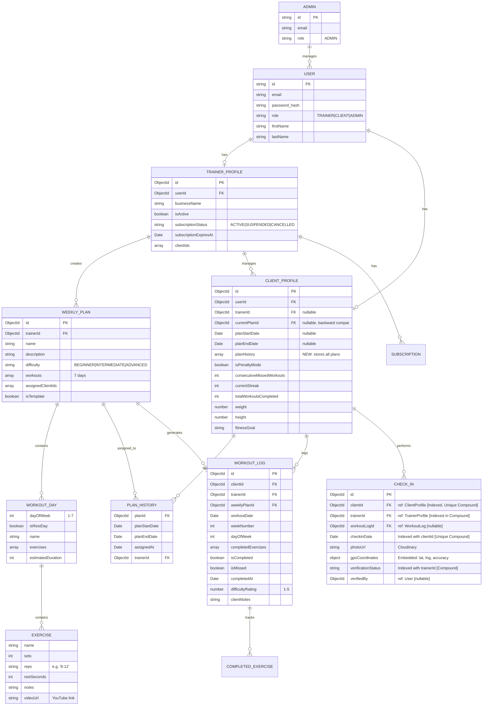
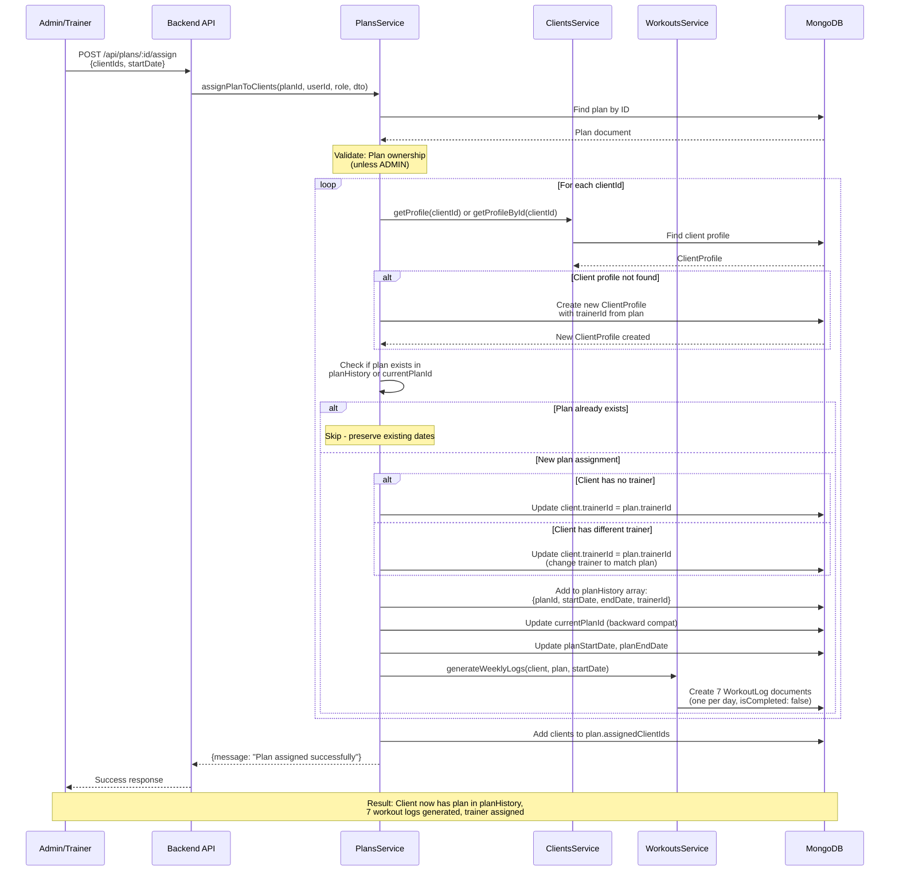
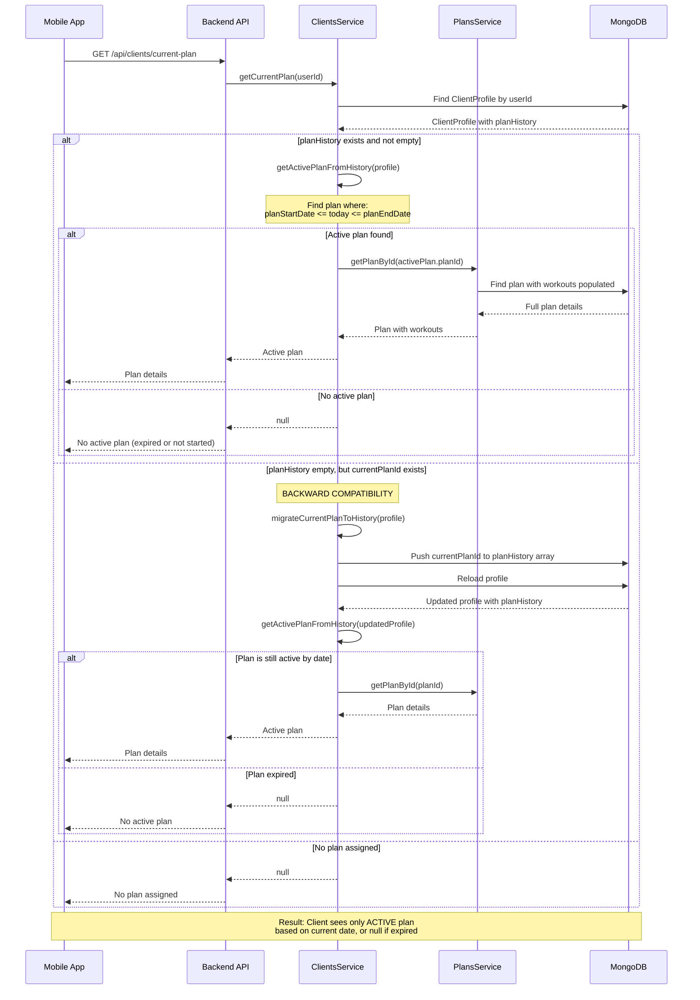
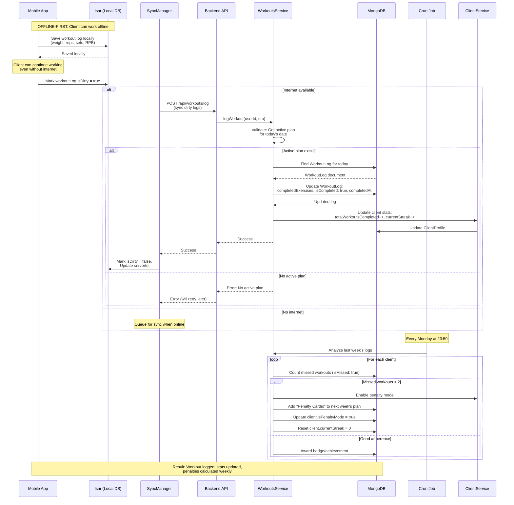
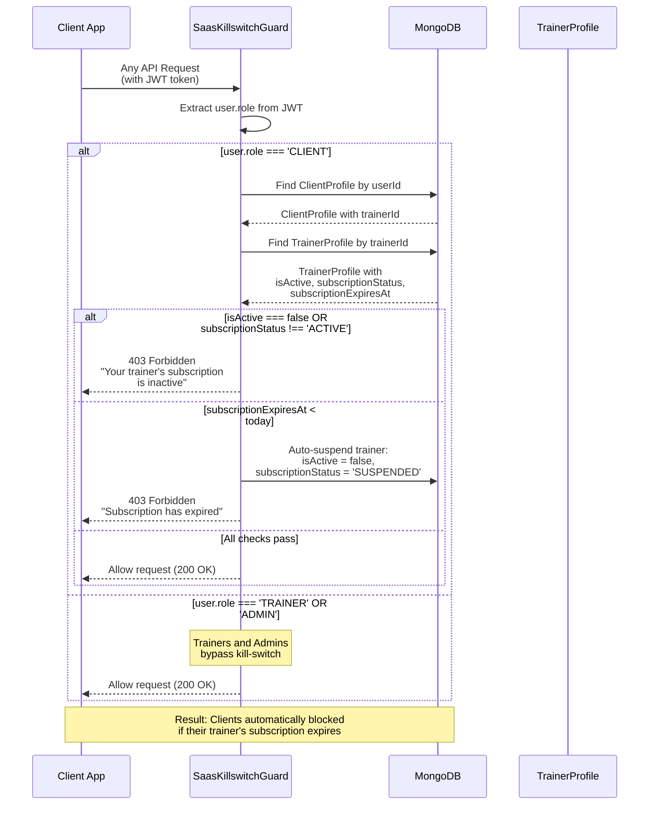
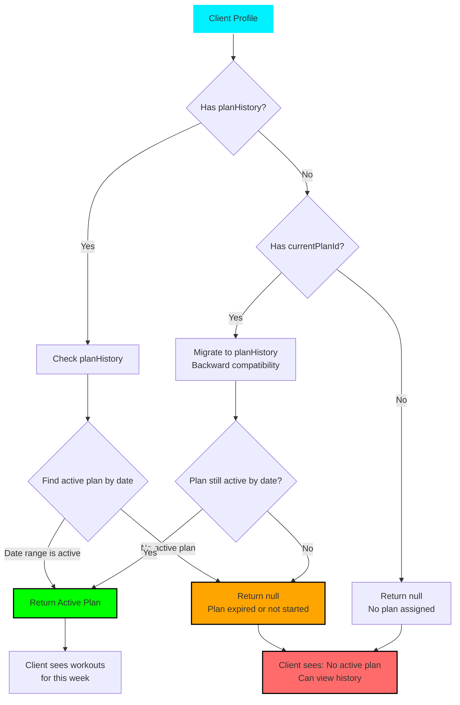
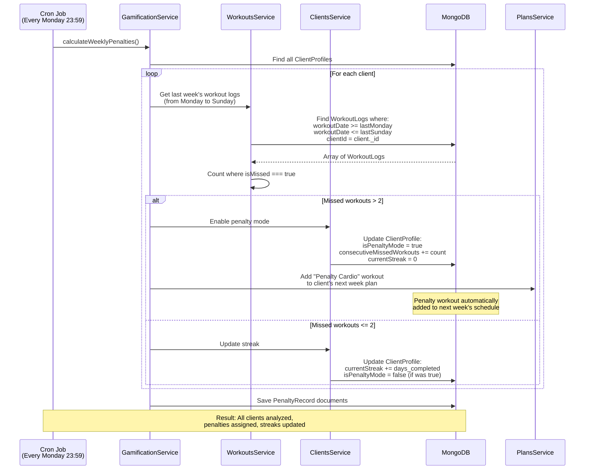
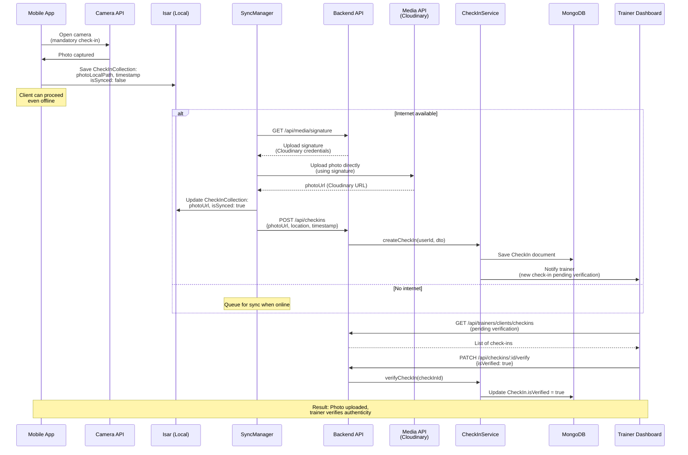

# KINETIX - System Architecture Diagrams

## 1. Entity Relationship Diagram (ERD)

---

## 1.1. Database Connection Details

### Reference Relationships (MongoDB `ref:`)

MongoDB references are used to link documents across collections. Use `.populate()` to join data at query time.

- **USER → TRAINER_PROFILE**: `TrainerProfile.userId` refs `User._id` [Unique Index]
- **USER → CLIENT_PROFILE**: `ClientProfile.userId` refs `User._id` [Unique Index]
- **TRAINER_PROFILE → CLIENT_PROFILE**: `ClientProfile.trainerId` refs `TrainerProfile._id` [Indexed, nullable]
- **TRAINER_PROFILE → WEEKLY_PLAN**: `WeeklyPlan.trainerId` refs `TrainerProfile._id` [Indexed]
- **CLIENT_PROFILE → WEEKLY_PLAN**: `ClientProfile.currentPlanId` refs `WeeklyPlan._id` [Indexed, nullable]
- **CLIENT_PROFILE.planHistory[]**: Array with embedded `planId` refs `WeeklyPlan._id`
- **CLIENT_PROFILE.planHistory[]**: Array with embedded `trainerId` refs `TrainerProfile._id`
- **WEEKLY_PLAN → CLIENT_PROFILE**: `WeeklyPlan.assignedClientIds[]` array refs `ClientProfile._id`
- **WORKOUT_LOG → CLIENT_PROFILE**: `WorkoutLog.clientId` refs `ClientProfile._id` [Indexed in compound]
- **WORKOUT_LOG → TRAINER_PROFILE**: `WorkoutLog.trainerId` refs `TrainerProfile._id` [Indexed in compound]
- **WORKOUT_LOG → WEEKLY_PLAN**: `WorkoutLog.weeklyPlanId` refs `WeeklyPlan._id` [Indexed]
- **CHECK_IN → CLIENT_PROFILE**: `CheckIn.clientId` refs `ClientProfile._id` [Indexed in compound, unique]
- **CHECK_IN → TRAINER_PROFILE**: `CheckIn.trainerId` refs `TrainerProfile._id` [Indexed in compound]
- **CHECK_IN → WORKOUT_LOG**: `CheckIn.workoutLogId` refs `WorkoutLog._id` [nullable]

### Embedded Documents (Stored in parent document)

- **WEEKLY_PLAN.workouts[]**: Embedded array of `WorkoutDay` objects (7 days)
- **WorkoutDay.exercises[]**: Embedded array of `Exercise` objects within WorkoutDay
- **WORKOUT_LOG.completedExercises[]**: Embedded array of `CompletedExercise` objects
- **CLIENT_PROFILE.planHistory[]**: Embedded array of plan history entries (planId, dates, trainerId)
- **CHECK_IN.gpsCoordinates**: Embedded `GpsCoordinates` object (lat, lng, accuracy)

### Database Indexes (Performance Optimization)

#### CLIENT_PROFILE Indexes
- `userId` [Unique] - One profile per user
- `trainerId` [Single] - Fast trainer queries
- `trainerId + currentPlanId` [Compound] - Trainer's clients with specific plan
- `currentPlanId` [Single] - Find all clients with plan

#### TRAINER_PROFILE Indexes
- `userId` [Unique] - One profile per user
- `isActive` [Single] - Filter active trainers
- `subscriptionExpiresAt` [Single] - Find expiring subscriptions

#### WEEKLY_PLAN Indexes
- `trainerId` [Single] - Trainer's plans
- `trainerId + isTemplate` [Compound] - Trainer's templates vs assigned plans
- `isTemplate` [Single] - All templates

#### WORKOUT_LOG Indexes
- `clientId + workoutDate` [Compound, Unique] - Prevent duplicate logs per day
- `trainerId` [Single] - Trainer's client logs
- `trainerId + workoutDate` [Compound] - Trainer's logs by date
- `weeklyPlanId` [Single] - Logs for specific plan
- `isCompleted` [Single] - Completed workouts
- `isMissed` [Single] - Missed workouts (penalty calculation)

#### CHECK_IN Indexes
- `clientId + checkinDate` [Compound, Unique] - One check-in per day
- `trainerId + verificationStatus` [Compound] - Pending check-ins for trainer

### Populate Patterns (How data is joined at query time)

- **Get Client Profile**: `.populate('userId')`, `.populate('trainerId')`, `.populate('currentPlanId')`
- **Get Weekly Plan**: `.populate('trainerId')`, `.populate('assignedClientIds')`
- **Get Workout Log**: `.populate('clientId')`, `.populate('trainerId')`, `.populate('weeklyPlanId')`
- **Get Trainer Clients**: `.populate('clientIds')` - All clients for trainer
- **Admin Queries**: Multiple populate chains for full data hierarchy

### Bidirectional Relationships

#### TRAINER ↔ CLIENT
- `TrainerProfile.clientIds[]` → Array of `ClientProfile._id`
- `ClientProfile.trainerId` → Single `TrainerProfile._id`
- *Maintained manually in code (not enforced by DB)*

#### WEEKLY_PLAN ↔ CLIENT
- `WeeklyPlan.assignedClientIds[]` → Array of `ClientProfile._id`
- `ClientProfile.currentPlanId` → Single `WeeklyPlan._id` (current)
- `ClientProfile.planHistory[]` → Array with `planId` references (all history)

---

## 2. Plan Assignment Flow (Kako Admin/Trener dodeljuje plan klijentu)

---

## 3. Get Active Plan Flow (Kako klijent dobija svoj aktivan plan)

---

## 4. Workout Logging Flow (Kako klijent loguje workout)

---

## 5. Admin Dashboard - Full Control Flow

```mermaid
graph TD
    A[Admin Dashboard] --> B[User Management]
    A --> C[Trainer Management]
    A --> D[Plan Management]
    A --> E[Workout Management]
    A --> F[Client Management]
    A --> G[System Stats]
    
    B --> B1[Create User<br/>CLIENT/TRAINER/ADMIN]
    B --> B2[Edit User<br/>email, name, role]
    B --> B3[Delete User<br/>with cascade]
    B --> B4[View All Users<br/>with filters]
    
    C --> C1[View All Trainers<br/>with subscription status]
    C --> C2[Assign Clients to Trainer<br/>or Unassign]
    C --> C3[Activate/Suspend Trainer<br/>Kill-switch control]
    C --> C4[View Trainer's Clients]
    C --> C5[Manage Subscription<br/>expiry, status]
    
    D --> D1[Create Plan<br/>for any trainer]
    D --> D2[Edit Plan<br/>workouts, exercises]
    D --> D3[Delete Plan<br/>with validation]
    D --> D4[Assign Plan to Clients<br/>bypass trainer ownership]
    D --> D5[View Plan Details<br/>assigned clients, history]
    D --> D6[Duplicate Plan<br/>as template]
    
    E --> E1[View All Workout Logs<br/>by client, date, plan]
    E --> E2[View Workout Details<br/>exercises, sets, reps]
    E --> E3[Manual Log Correction<br/>if needed]
    E --> E4[View Completion Stats<br/>per client/week]
    
    F --> F1[View All Clients<br/>with trainer info]
    F --> F2[View Client Profile<br/>metrics, goals, stats]
    F --> F3[View Client Plan History<br/>all assigned plans]
    F --> F4[View Active Plan<br/>current week]
    F --> F5[Assign/Reassign Client<br/>to different trainer]
    F --> F6[View Client Workouts<br/>completed, missed]
    
    G --> G1[Total Users<br/>Trainers, Clients]
    G --> G2[Active Subscriptions<br/>Suspended, Expired]
    G --> G3[Total Plans Created<br/>Templates vs Assigned]
    G --> G4[Workout Completion Rate<br/>Average across all clients]
    G --> G5[System Health<br/>API uptime, DB status]
    
    style A fill:#00F0FF,stroke:#fff,stroke-width:3px
    style B fill:#1E1E1E,stroke:#00F0FF,stroke-width:2px
    style C fill:#1E1E1E,stroke:#00F0FF,stroke-width:2px
    style D fill:#1E1E1E,stroke:#00F0FF,stroke-width:2px
    style E fill:#1E1E1E,stroke:#00F0FF,stroke-width:2px
    style F fill:#1E1E1E,stroke:#00F0FF,stroke-width:2px
    style G fill:#1E1E1E,stroke:#00F0FF,stroke-width:2px
```

---

## 6. Admin Actions - Detailed Flow

```mermaid
sequenceDiagram
    participant Admin as Admin Dashboard
    participant AdminAPI as Admin API
    participant PlansAPI as Plans API
    participant ClientsAPI as Clients API
    participant TrainersAPI as Trainers API
    participant DB as MongoDB

    Note over Admin,DB: ADMIN BYPASSES ALL GUARDS AND OWNERSHIP CHECKS

    rect rgb(30, 30, 30)
        Note over Admin,DB: PLAN MANAGEMENT
        Admin->>PlansAPI: POST /api/plans<br/>{name, workouts, trainerId}
        PlansAPI->>DB: Create plan (any trainer)
        
        Admin->>PlansAPI: PATCH /api/plans/:id<br/>{...updates}
        Note over PlansAPI: Admin can edit ANY plan
        
        Admin->>PlansAPI: DELETE /api/plans/:id
        Note over PlansAPI: Admin can delete ANY plan<br/>(even if clients assigned)
        
        Admin->>PlansAPI: POST /api/plans/:id/assign<br/>{clientIds, startDate}
        Note over PlansAPI: Admin can assign ANY plan<br/>to ANY clients (bypass trainer check)
    end
    
    rect rgb(30, 30, 30)
        Note over Admin,DB: CLIENT MANAGEMENT
        Admin->>ClientsAPI: GET /api/admin/clients
        ClientsAPI->>DB: Find all clients<br/>(populate trainer, currentPlan)
        
        Admin->>ClientsAPI: GET /api/admin/clients/:id
        ClientsAPI->>DB: Get client + planHistory
        
        Admin->>TrainersAPI: POST /api/admin/assign-client<br/>{clientId, trainerId}
        TrainersAPI->>DB: Update client.trainerId<br/>Remove from old trainer.clientIds<br/>Add to new trainer.clientIds
        
        Admin->>TrainersAPI: POST /api/admin/assign-client<br/>{clientId, trainerId: null}
        Note over TrainersAPI: Unassign client from trainer<br/>(client.trainerId = null)
    end
    
    rect rgb(30, 30, 30)
        Note over Admin,DB: TRAINER MANAGEMENT
        Admin->>TrainersAPI: GET /api/admin/trainers
        TrainersAPI->>DB: Find all trainers<br/>(populate subscription, clients)
        
        Admin->>TrainersAPI: PATCH /api/admin/trainers/:id<br/>{isActive: false}
        Note over TrainersAPI: Suspend trainer<br/>→ Kill-switch activates<br/>→ All clients get 403
        
        Admin->>TrainersAPI: PATCH /api/admin/trainers/:id<br/>{subscriptionExpiresAt}
        Note over TrainersAPI: Extend subscription<br/>→ Trainer stays active
    end
    
    rect rgb(30, 30, 30)
        Note over Admin,DB: USER MANAGEMENT
        Admin->>AdminAPI: POST /api/admin/users<br/>{email, role, password}
        AdminAPI->>DB: Create user (any role)
        
        Admin->>AdminAPI: PATCH /api/admin/users/:id
        AdminAPI->>DB: Update user (role, email, etc.)
        
        Admin->>AdminAPI: DELETE /api/admin/users/:id
        Note over AdminAPI: Delete user + cascade:<br/>- If TRAINER: Delete TrainerProfile<br/>- If CLIENT: Delete ClientProfile
    end

    Note over Admin,DB: Admin has FULL CONTROL over entire system
```

---

## 7. Kill-Switch Flow (SaaS Protection)

---

## 8. Plan History vs Current Plan Logic

---

## 9. Weekly Penalty Calculation (Cron Job)

---

## 10. Check-In Flow (Photo Verification)

---

## Summary: Key Concepts

### 1. **Admin vs Trainer vs Client Roles**
- **Admin**: Full control, bypasses all ownership checks
- **Trainer**: Creates plans, assigns to own clients, manages subscription
- **Client**: Views active plan, logs workouts, checks in

### 2. **Plan Management**
- Plans stored in `planHistory` array (supports multiple plans)
- Only ONE plan is ACTIVE at a time (determined by date)
- Admin can assign ANY plan to ANY client (bypass trainer ownership)

### 3. **Offline-First Architecture**
- Mobile app uses Isar (local DB) for all operations
- Sync happens in background (Fire & Forget)
- Client can work completely offline

### 4. **Kill-Switch Protection**
- Clients blocked automatically if trainer subscription expires
- Guard checks on EVERY client API request
- Trainers/Admins bypass kill-switch

### 5. **Weekly Penalty System**
- Cron job runs every Monday at 23:59
- Analyzes previous week's workout completion
- Automatically assigns penalty workouts if >2 missed

### 6. **Active Plan Logic**
- Plan is ACTIVE if: `planStartDate <= today <= planEndDate`
- `getCurrentPlan` returns null if plan expired or not started
- Client can view full plan history via `/api/clients/plan-history`

